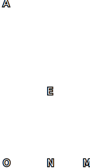
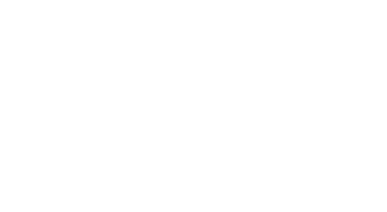

# Mathematical Explanations

Consider this figure. We need to find the coordinates of all points (`A` to `G`, along with oters) in terms of `r` (the radius of circle `O`). To make the process easier, let's assume the center of the circle (point `O`) is at `(0,0)`

    
tl;dr spoiler

# A and B

# C and D

# E

(we also need to find `|AE|` for point [`F`](#f))

# F

- The reason why  is trivial and left as an exercise to the reader.
    

spoiler

    
    

# G

