# A Geometrical Approach
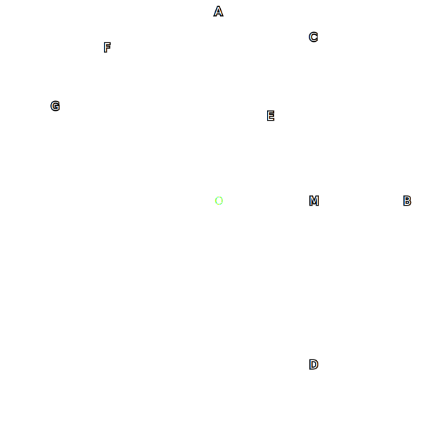

Consider this figure. We need to find the coordinates of all points (`A` to `G`, along with others) in terms of `r` (the radius of circle `O`). To make the process easier, let's assume the center of the circle (point `O`) is at `(0,0)`

    
tl;dr spoiler

## A and B
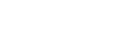

## C and D
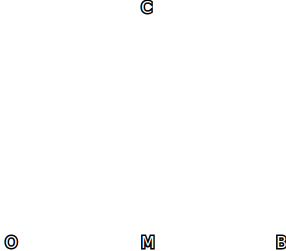

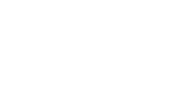

## E

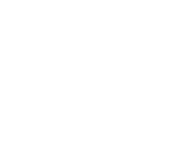

(we also need to find `|AE|` for point [`F`](#f))

## F
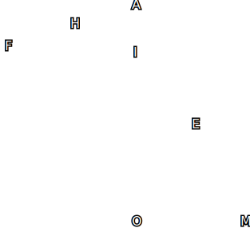

- The reason why  is trivial and left as an exercise to the reader.
    

spoiler

    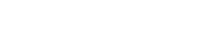
    

## G
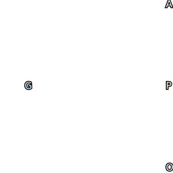

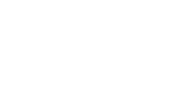

# An Algebraic Approach
This is a zoomed-in view of the arc `FG`. Because we are considering the stroke widths, we need to find the 4 intersections (`y1` to `y4`) of the 4 graphs using algebra.
Let the stroke width of the center circle be `2c` and the others, `2s`. 

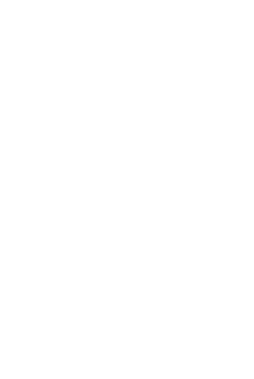

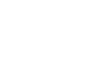

# Implementation
> the code where these maths are implemented is in [`stores.ts`](../src/stores.ts)

